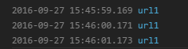

## 变量声明`let`和`const`

> let 和 const 都是块级作用域。

> 只要在{}花括号内的代码块即可以认为 let 和 const 的作用域。

> const 声明的变量必须提供一个值，而且它的值被设置完成后就不能再修改了。

## 字符串
- 模板字符串

```
    // ${} 引用表达式
    const name = 'lux'
    console.log(`hello ${name}`) //hello lux

    // 多行
    const template = `<div>
        <span>hello world</span>
    </div>`

    // includes：判断是否包含然后直接返回布尔值
    const str = 'hahay'
    console.log(str.includes('y')) // true
```
- repeat: 获取字符串重复n次

```
    const str = 'he'
    console.log(str.repeat(3)) // 'hehehe'
    //如果你带入小数, Math.floor(num) 来处理
    // s.repeat(3.1) 或者 s.repeat(3.9) 都当做成 s.repeat(3) 来处理
```

- startsWith 和 endsWith 判断是否以 给定文本 开始或者结束

```
    const str =  'hello world!'
    console.log(str.startsWith('hello')) // true
    console.log(str.endsWith('!')) // true
```

## 函数
- 函数默认参数

```
    function action(num = 200) {
        console.log(num)
    }
    action(0) // 0
    action() //200
    action(300) //300
```

- 箭头函数

箭头函数最直观的三个特点：

1、不需要 function 关键字来创建函数

2、省略 return 关键字

3、继承当前上下文的 this 关键字

```
    [1,2,3].map((function(x){
        return x + 1
    }).bind(this))

    var people = name => 'hello' + name


    var people = (name, age) => {
        const fullName = 'hello' + name
        return fullName
    } 
```

## 拓展的对象功能

- 对象初始化简写

```
    function people(name, age) {
        return {
            name,
            age
        };
    }

	// 对象字面量方法赋值省略:和function
    const people = {
        name: 'lux',
        getName () {
            console.log(this.name)
        }
    }
```

- 使用`Object.assign()`方法来实现浅复制

`Object.assign()`可以把任意多个源对象自身可枚举的属性拷贝给目标对象，然后返回目标对象。第一参数即为目标对象。在实际项目中，我们为了不改变源对象。一般会把目标对象传为`{}`

```
    const objA = { name: 'cc', age: 18 }
    const objB = { address: 'beijing' }
    const objC = {} // 这个为目标对象
    const obj = Object.assign(objC, objA, objB)

    // 我们将 objA objB objC obj 分别输出看看
    console.log(objA)   // { name: 'cc', age: 18 }
    console.log(objB) // { address: 'beijing' }
    console.log(objC) // { name: 'cc', age: 18, address: 'beijing' }
    console.log(obj) // { name: 'cc', age: 18, address: 'beijing' }

    // 是的，目标对象ObjC的值被改变了。
    // so，如果objC也是你的一个源对象的话。请在objC前面填在一个目标对象{}
    Object.assign({}, objC, objA, objB)
```

## 解构

- 数组和对象是JS中最常用也是最重要表示形式。为了简化提取信息，ES6新增了解构，这是将一个数据结构分解为更小的部分的过程

```
    //对象
    const people = {
        name: 'lux',
        age: 20
    }
    const { name, age } = people
    console.log(`${name} --- ${age}`)
    //数组
    const color = ['red', 'blue']
    const [first, second] = color
    console.log(first) //'red'
    console.log(second) //'blue'


    /* 用 ES6 重构一下代码 */
    // 第一题
    var jsonParse = require('body-parser').jsonParse

    // 答案
    import { jsonParse } from 'body-parser'

    // 第二题
    var body = request.body
    var username = body.username
    var password = body.password
    // 答案
    const { body, body: { username, password } } = request
```

## Spread Operator 展开运算符

- 组装对象或者数组

```
    //数组
    const color = ['red', 'yellow']
    const colorful = [...color, 'green', 'pink']
    console.log(colorful) //[red, yellow, green, pink]
    
    //对象
    const alp = { fist: 'a', second: 'b'}
    const alphabets = { ...alp, third: 'c' }
    console.log(alphabets) //{ "fist": "a", "second": "b", "third": "c"}
```

- 获取数组或者对象的某几项

```
    //数组
    const number = [1,2,3,4,5]
    const [first, ...rest] = number
    console.log(rest) //2,3,4,5
    //对象
    const user = {
        username: 'lux',
        gender: 'female',
        age: 19,
        address: 'peking'
    }
    const { username, ...rest } = user
    console.log(rest) //{"address": "peking", "age": 19, "gender": "female"}
```

- 组合新的 Object；如果有重复的属性名，右边覆盖左边

```
    const first = {
        a: 1,
        b: 2,
        c: 6,
    }
    const second = {
        c: 3,
        d: 4
    }
    const total = { ...first, ...second }
    console.log(total) // { a: 1, b: 2, c: 3, d: 4 }
```

## import 和 export

- import导入模块、export导出模块

```
//导入默认
import people from './example'

//将整个模块当作单一对象进行导入
//该模块的所有导出会作为该对象的属性存在
import * as example from "./example.js"
console.log(example.name)
console.log(example.age)
console.log(example.getName())

//导入部分
import {name, age} from './example'

// 导出默认, 有且只有一个默认
export default App

// 部分导出
export App
```

- 导入的时候有没有大括号的区别总结：

1. 当用export default people导出时，就用 import people 导入（不带大括号）；

2. 一个文件里，有且只能有一个export default，但可以有多个export；

3. 当用export name 时，就用import { name }导入（记得带上大括号）；

4. 当一个文件里，既有一个export default people, 又有多个export name 或者 export age时，导入就用 import people, { name, age }；

5. 当一个文件里出现n多个 export 导出很多模块，导入时除了一个一个导入，也可以用import * as example。

## Promise

Promise是一个构造函数，自己身上有all、reject、resolve这几个眼熟的方法，原型上有then、catch等同样很眼熟的方法。

- 基础用法：

```
var p = new Promise(function(resolve, reject){
    //做一些异步操作
    setTimeout(function(){
        console.log('执行完成');
        resolve('随便什么数据');
    }, 2000);
});

p.then(function(data){
    console.log(data);
});
```

- 使用Promise的时候一般是包裹在一个函数中，在需要的时候去运行这个函数：

```
function runAsync(){
    var p = new Promise(function(resolve, reject){
        //做一些异步操作
        setTimeout(function(){
            console.log('执行完成');
            resolve('随便什么数据');
        }, 2000);
    });
    return p;            
}

runAsync().then(function(data){
    console.log(data);
    //后面可以用传过来的数据做些其他操作
    //......
});
```

- 链式操作的用法

```
// runAsync1
function runAsync1(){
    var p = new Promise(function(resolve, reject){
        //做一些异步操作
        setTimeout(function(){
            console.log('异步任务1执行完成');
            resolve('随便什么数据1');
        }, 1000);
    });
    return p;            
}

// runAsync2
function runAsync2(){
    var p = new Promise(function(resolve, reject){
        //做一些异步操作
        setTimeout(function(){
            console.log('异步任务2执行完成');
            resolve('随便什么数据2');
        }, 2000);
    });
    return p;            
}

// runAsync3
function runAsync3(){
    var p = new Promise(function(resolve, reject){
        //做一些异步操作
        setTimeout(function(){
            console.log('异步任务3执行完成');
            resolve('随便什么数据3');
        }, 2000);
    });
    return p;            
}

// 调用
runAsync1()
.then(function(data){
    console.log(data);
    return runAsync2();
})
.then(function(data){
    console.log(data);
    return runAsync3();
})
.then(function(data){
    console.log(data);
});

// 执行结果
// 异步任务1执行完成
// 随便什么数据1
// 异步任务2执行完成
// 随便什么数据2
// 异步任务3执行完成
// 随便什么数据3

// 在then方法中，可以直接return数据而不是Promise对象，在后面的then中就可以接收到数据了，我们把上面的代码修改成这样：

runAsync1()
.then(function(data){
    console.log(data);
    return runAsync2();
})
.then(function(data){
    console.log(data);
    return '直接返回数据';  //这里直接返回数据
})
.then(function(data){
    console.log(data);
});
// 执行结果
// 异步任务1执行完成
// 随便什么数据1
// 异步任务2执行完成
// 随便什么数据2
// 直接返回数据
```

- reject的用法

```
function getNumber(){
    var p = new Promise(function(resolve, reject){
        //做一些异步操作
        setTimeout(function(){
            var num = Math.ceil(Math.random()*10); //生成1-10的随机数
            if(num<=5){
                resolve(num);
            }
            else{
                reject('数字太大了');
            }
        }, 2000);
    });
    return p;            
}

getNumber()
.then(
    function(data){
        console.log('resolved');
        console.log(data);
    }, 
    function(reason, data){
        console.log('rejected');
        console.log(reason);
    }
);
```

- catch的用法

```
// 指定reject的回调
getNumber()
.then(function(data){
    console.log('resolved');
    console.log(data);
})
.catch(function(reason){
    console.log('rejected');
    console.log(reason);
});

// 另外一个作用：在执行resolve的回调（也就是then中的第一个参数）时，如果抛出异常了（代码出错了），那么并不会报错卡死js，而是会进到这个catch方法中
getNumber()
.then(function(data){
    console.log('resolved');
    console.log(data);
    console.log(somedata); //此处的somedata未定义
})
.catch(function(reason){
    console.log('rejected');
    console.log(reason);
});
```

- all的用法

```
// 并行执行异步操作，并且在所有异步操作执行完后才执行回调
Promise
.all([runAsync1(), runAsync2(), runAsync3()])
.then(function(results){
    console.log(results);
});
```

- race的用法

```
// 只要有一个异步操作执行完就执行回调
Promise
.race([runAsync1(), runAsync2(), runAsync3()])
.then(function(results){
    console.log(results);
});
```

- race使用实例设置图片超时操作

```
//请求某个图片资源
function requestImg(){
    var p = new Promise(function(resolve, reject){
        var img = new Image();
        img.onload = function(){
            resolve(img);
        }
        img.src = 'xxxxxx';
    });
    return p;
}

//延时函数，用于给请求计时
function timeout(){
    var p = new Promise(function(resolve, reject){
        setTimeout(function(){
            reject('图片请求超时');
        }, 5000);
    });
    return p;
}

Promise
.race([requestImg(), timeout()])
.then(function(results){
    console.log(results);
})
.catch(function(reason){
    console.log(reason);
});
```

## Generators

- 简单使用

1. 声明

Generator的声明方式类似一般的函数声明，只是多了个`*`号，并且一般可以在函数内看到yield关键字

```
function* showWords() {
    yield 'one';
    yield 'two';
    return 'three';
}

var show = showWords();

show.next() // {done: false, value: "one"}
show.next() // {done: false, value: "two"}
show.next() // {done: true, value: "three"}
show.next() // {done: true, value: undefined}
```

如上代码，定义了一个`showWords`的生成器函数，调用之后返回了一个迭代器对象（即show）

调用`next`方法后，函数内执行第一条`yield`语句，输出当前的状态done（迭代器是否遍历完成）以及相应值（一般为yield关键字后面的运算结果）

每调用一次`next`，则执行一次`yield`语句，并在该处暂停，`return`完成之后，就退出了生成器函数，后续如果还有`yield`操作就不再执行了

2. `yield`和`yield*`

有时候，我们会看到`yield`之后跟了一个`*`号，它是什么，有什么用呢？

类似于生成器前面的`*`号，`yield`后面的星号也跟生成器有关，举个大栗子：

```
function* showWords() {
    yield 'one';
    yield showNumbers();
    return 'three';
}

function* showNumbers() {
    yield 10 + 1;
    yield 12;
}

var show = showWords();
show.next() // {done: false, value: "one"}
show.next() // {done: false, value: showNumbers}
show.next() // {done: true, value: "three"}
show.next() // {done: true, value: undefined}
```

增添了一个生成器函数，我们想在`showWords`中调用`showNumbers`，简单的`yield showNumbers()`之后发现并没有执行函数里面的`yield 10+1`

因为`yield`只能原封不动地返回右边运算后值，但现在的`showNumbers()`不是一般的函数调用，返回的是迭代器对象

`yield*` 可以让它自动遍历进该迭代器对象

```
function* showWords() {
    yield 'one';
    yield* showNumbers();
    return 'three';
}

function* showNumbers() {
    yield 10 + 1;
    yield 12;
}

var show = showWords();
show.next() // {done: false, value: "one"}
show.next() // {done: false, value: 11}
show.next() // {done: false, value: 12}
show.next() // {done: true, value: "three"}
```

`yield`和`yield*`只能在`generator`函数内部使用，一般的函数内使用会报错

```
function showWords() {
    yield 'one'; // Uncaught SyntaxError: Unexpected string
}
```

虽然换成`yield*`不会直接报错，但使用的时候还是会有问题，因为`one`字符串中没有`Iterator`接口，没有`yield`提供遍历

```
function showWords() {
    yield* 'one'; 
}

var show = showWords();

show.next() // Uncaught ReferenceError: yield is not defined
```

在爬虫开发中，我们常常需要请求多个地址，为了保证顺序，引入`Promise`对象和`Generator`生成器函数，看这个简单的栗子：

```
var urls = ['url1', 'url2', 'url3'];

function* request(urls) {
    // forEach遍历url数组
    // 匿名函数内部不能使用yield关键字
    // urls.forEach(function(url) {
    //     yield req(url);
    // });

    for (var i = 0, j = urls.length; i < j; ++i) {
         yield req(urls[i]);
    }
}

var r = request(urls);
r.next();

function req(url) {
    var p = new Promise(function(resolve, reject) {
        $.get(url, function(rs) {
            resolve(rs);
        });
    });

    p.then(function() {
        r.next();
    }).catch(function() {

    });
}
```

3. `next()`调用中的传参

参数值有注入的功能，可改变上一个`yield`的返回值，例如：

```
function* showNumbers() {
    var one = yield 1;
    var two = yield 2 * one;
    yield 3 * two;
}

var show = showNumbers();

show.next().value // 1
show.next().value // NaN
show.next(2).value // 6
```

第一次调用`next`之后返回值`one`为`1`，但在第二次调用`next`的时候`one`的值其实是`undefined`，因为`generator`不会自动保存相应变量值，我们需要手动的指定，这时`two`值为`NaN`，在第三次调用`next`的时候执行到`yield 3 * two`，通过传参将上次`yield`返回值`two`设为`2`，得到结果

另一个栗子：

由于`ajax`请求涉及到网络，不好处理，这里用了`setTimeout`模拟`ajax`的请求返回，按顺序进行，并传递每次返回的数据

```
	var urls = ['url1', 'url2', 'url3'];

	function* request(urls) {
		var data;

		for (var i = 0, j = urls.length; i < j; ++i) {
			data = yield req(urls[i], data);
		}
	}

	var r = request(urls);
	r.next();

	function log(url, data, cb) {
		setTimeout(function() {
			cb(url);
		}, 1000);
	}


	function req(url, data) {
		var p = new Promise(function(resolve, reject) {
			log(url, data, function(rs) {
				if (!rs) {
					reject();
				} else {
					resolve(rs);
				}
			});
		});

		p.then(function(data) {
			console.log(data);
			r.next(data);
		}).catch(function() {
			
		});
	}
```

达到了按顺序请求三个地址的效果，初始直接`r.next()`无参数，后续通过`r.next(data)`将data数据传入


注意代码的第16行，这里参数用了`url`变量，是为了和`data`数据做对比

因为初始`next()`没有参数，若是直接将`url`换成`data`的话，就会因为`promise`对象的数据判断`!rs == undefined`而`reject`

所以将第16行换成`cb(data || url)`



通过模拟的`ajax`输出，可了解到`next`的传参值，第一次在`log`输出的是`url = 'url1'`值，后续将`data = 'url1'`传入`req`请求，在`log`中输出`data = 'url1'`值

4. `for...of`循环代替`.next()`
除了使用`.next()`方法遍历迭代器对象外，通过ES6提供的新循环方式`for...of`也可遍历，但与`next`不同的是，它会忽略`return`返回的值，如

```
function* showNumbers() {
    yield 1;
    yield 2;
    return 3;
}

var show = showNumbers();

for (var n of show) {
    console.log(n) // 1 2
}
```

此外，处理for...of循环，具有调用迭代器接口的方法方式也可遍历生成器函数，如扩展运算符...的使用

```
function* showNumbers() {
    yield 1;
    yield 2;
    return 3;
}

var show = showNumbers();

[...show] // [1, 2, length: 2]
```

[1](https://segmentfault.com/a/1190000008677697)

[2](https://segmentfault.com/a/1190000011526612)
