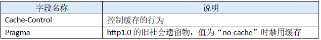
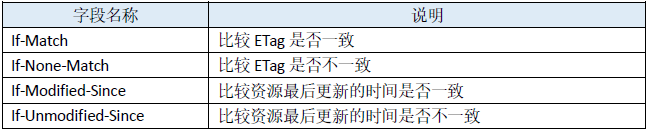
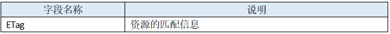
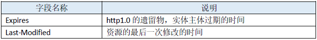
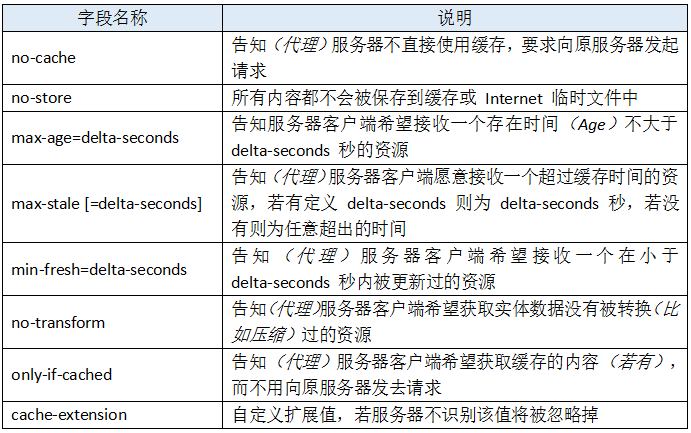
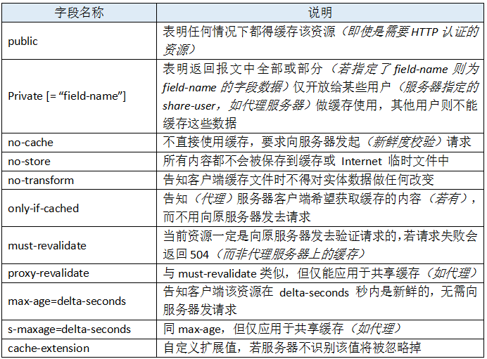
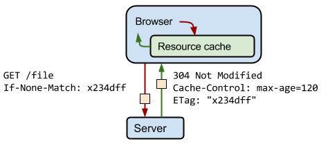

# http缓存相关

## 相关字段简述

RFC2616规定的47种http报文首部字段中与缓存相关的字段。

### 通用头部字段


### 请求头部字段


### 响应头部字段


### 实体头部字段


## Pragma与Expires

在 http1.0 时代，给客户端设定缓存方式可通过两个字段——Pragma和Expires来规范。虽然这两个字段早可抛弃，但为了做http协议的向下兼容，我们还是可以看到很多网站依旧会带上这两个字段。

### Pragma
当该字段值为no-cache的时候（事实上现在RFC中也仅标明该可选值），会知会客户端不要对该资源读缓存，即每次都得向服务器发一次请求才行。

### Expires
有了Pragma来禁用缓存，自然也需要有个东西来启用缓存和定义缓存时间，对http1.0而言，Expires就是做这件事的首部字段。 Expires的值对应一个GMT（格林尼治时间），比如Mon, 22 Jul 2002 11:12:01 GMT来告诉浏览器资源缓存过期时间，如果还没过该时间点则不发请求。

### Tips
如果Pragma头部和Expires头部同时存在，则起作用的会是Pragma，有兴趣的同学可以自己试一下。

需要注意的是，响应报文中Expires所定义的缓存时间是相对服务器上的时间而言的，其定义的是资源“失效时刻”，如果客户端上的时间跟服务器上的时间不一致（特别是用户修改了自己电脑的系统时间），那么Expires所定义的缓存时间就没有意义了。

## Cache-Control
针对上述的“Expires时间是相对服务器而言，无法保证和客户端时间统一”的问题，http1.1新增了 Cache-Control 来定义缓存过期时间。注意：若报文中同时出现了Expires和Cache-Control，则以Cache-Control为准。

也就是说优先级从高到低分别是 Pragma -> Cache-Control -> Expires 。

Cache-Control也是一个通用首部字段，这意味着它能分别在请求报文和响应报文中使用。在RFC中规范了Cache-Control的格式为：

```
"Cache-Control" ":" cache-directive
```
作为请求首部时，cache-directive 的可选值有：



作为响应首部时，cache-directive 的可选值有：



Cache-Control 允许自由组合可选值，例如：

```
Cache-Control: max-age=3600, must-revalidate
```
它意味着该资源是从原服务器上取得的，且其缓存（新鲜度）的有效时间为一小时，在后续一小时内，用户重新访问该资源则无须发送请求。 当然这种组合的方式也会有些限制，比如no-cache就不能和max-age、min-fresh、max-stale一起搭配使用。

## 使用meta设置浏览器是否缓存html

通常情况下，通过以下方式设置不缓存html，即再次访问页面时重新加载html

```
<meta http-equiv="Expires" content="0">
<meta http-equiv="Pragma" content="no-cache">
<meta http-equiv="Cache-control" content="no-cache">
<meta http-equiv="Cache" content="no-cache">
```
### Pragma

禁止浏览器从本地缓存中访问html内容：

```
<meta http-equiv="Pragma" content="no-cache">
```

### cache-control
规定浏览器如何缓存某个响应以及缓存多长时间：



```
<meta http-equiv="cache-control" content="no-cache">
共有以下几种用法：
no-cache: 先发送请求，与服务器确认该资源是否被更改，如果未被更改，则使用缓存。
no-store: 不允许缓存，每次都要去服务器上，下载完整的响应。
public: 缓存所有响应，但并非必须。因为max-age也可以做到相同效果。
private: 只为单个用户缓存，因此不允许任何中继进行缓存。（比如说CDN就不允许缓存private的响应）。
maxage: 表示当前请求开始，该响应在多久内能被缓存和重用，而不去服务器重新请求。例如：max-age=60表示响应可以再缓存和重用60秒。
```

### expires
用于设定网页的到期时间，过期后网页必须重新从服务器获取：

```
<meta http-equiv="expires" content="Sunday 26 October 2016 01:00 GMT" />
```


https://segmentfault.com/a/1190000009652182