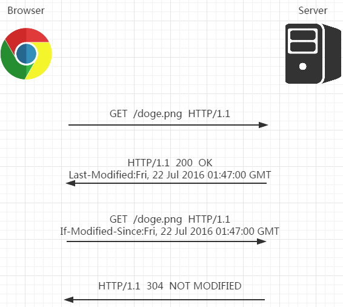
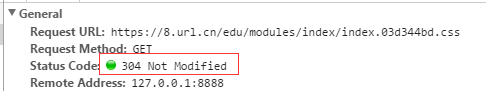
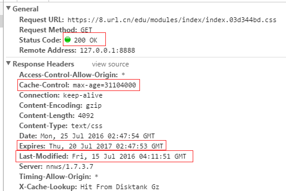
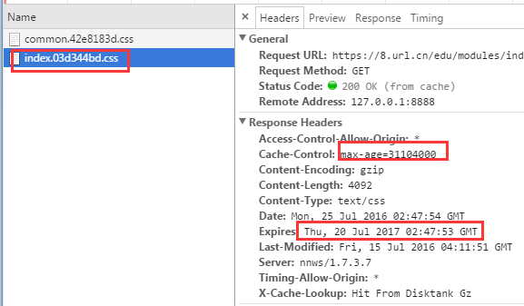
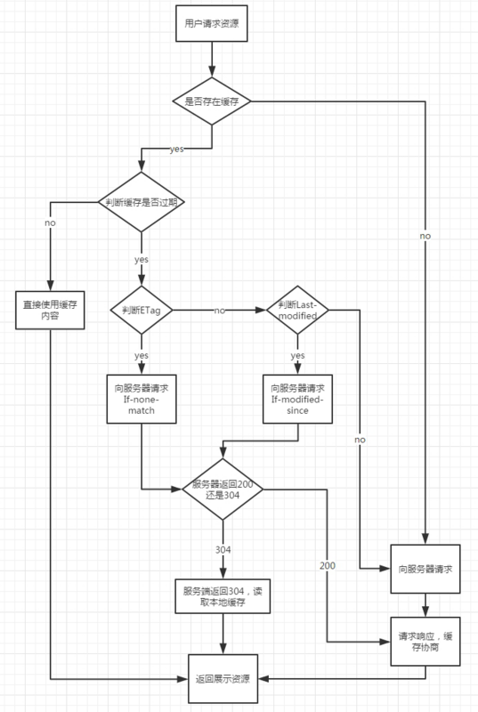

# http缓存详解

## 相关字段简述

RFC2616规定的47种http报文首部字段中与缓存相关的字段。

- 通用头部字段


- 请求头部字段


- 响应头部字段


- 实体头部字段


## Expires与Pragma

在 http1.0 时代，给客户端设定缓存方式可通过两个字段——Pragma和Expires来规范。虽然这两个字段早可抛弃，但为了做http协议的向下兼容，我们还是可以看到很多网站依旧会带上这两个字段。

- Pragma

> 当该字段值为no-cache的时候（事实上现在RFC中也仅标明该可选值），会知会客户端不要对该资源读缓存，即每次都得向服务器发一次请求才行。

- Expires

> 有了Pragma来禁用缓存，自然也需要有个东西来启用缓存和定义缓存时间，对http1.0而言，Expires就是做这件事的首部字段。 Expires的值对应一个GMT（格林尼治时间），比如Mon, 22 Jul 2002 11:12:01 GMT来告诉浏览器资源缓存过期时间，如果还没过该时间点则不发请求。

如果Pragma头部和Expires头部同时存在，则起作用的会是Pragma，有兴趣的同学可以自己试一下。

需要注意的是，响应报文中Expires所定义的缓存时间是相对服务器上的时间而言的，其定义的是资源“失效时刻”，如果客户端上的时间跟服务器上的时间不一致（特别是用户修改了自己电脑的系统时间），那么Expires所定义的缓存时间就没有意义了。

## Cache-Control
针对上述的“Expires时间是相对服务器而言，无法保证和客户端时间统一”的问题，http1.1新增了 Cache-Control 来定义缓存过期时间。注意：若报文中同时出现了Expires和Cache-Control，则以Cache-Control为准。

也就是说优先级从高到低分别是 Pragma -> Cache-Control -> Expires 。

Cache-Control也是一个通用首部字段，这意味着它能分别在请求报文和响应报文中使用。在RFC中规范了Cache-Control的格式为：

```
"Cache-Control" ":" cache-directive
```
作为请求首部时，cache-directive 的可选值有：


作为响应首部时，cache-directive 的可选值有：


Cache-Control 允许自由组合可选值，例如：

```
Cache-Control: max-age=3600, must-revalidate
```
它意味着该资源是从原服务器上取得的，且其缓存（新鲜度）的有效时间为一小时，在后续一小时内，用户重新访问该资源则无须发送请求。 当然这种组合的方式也会有些限制，比如no-cache就不能和max-age、min-fresh、max-stale一起搭配使用。


上述的首部字段均能让客户端决定是否向服务器发送请求，比如设置的缓存时间未过期，那么自然直接从本地缓存取数据即可（在chrome下表现为200 from cache），若缓存时间过期了或资源不该直接走缓存，则会发请求到服务器去。

我们现在要说的问题是，如果客户端向服务器发了请求，那么是否意味着一定要读取回该资源的整个实体内容呢？

我们试着这么想——客户端上某个资源保存的缓存时间过期了，但这时候其实服务器并没有更新过这个资源，如果这个资源数据量很大，客户端要求服务器再把这个东西重新发一遍过来，是否非常浪费带宽和时间呢？

答案是肯定的，那么是否有办法让服务器知道客户端现在存有的缓存文件，其实跟自己所有的文件是一致的，然后直接告诉客户端说“这东西你直接用缓存里的就可以了，我这边没更新过呢，就不再传一次过去了”。

为了让客户端与服务器之间能实现缓存文件是否更新的验证、提升缓存的复用率，Http1.1新增了几个首部字段来做这件事情。

## Last-Modified
服务器将资源传递给客户端时，会将资源最后更改的时间以“Last-Modified: GMT”的形式加在实体首部上一起返回给客户端。

```
Last-Modified: Fri, 22 Jul 2016 01:47:00 GMT
```
客户端会为资源标记上该信息，下次再次请求时，会把该信息附带在请求报文中一并带给服务器去做检查。

- 若传递的时间值与服务器上该资源最终修改时间是一致的，则说明该资源没有被修改过，直接返回304状态码，内容为空。

- 如果两个时间不一致，则服务器会发回该资源并返回200状态码，和第一次请求时类似。

这样保证不向客户端重复发出资源，也保证当服务器有变化时，客户端能够得到最新的资源。一个304响应比一个静态资源通常小得多，这样就节省了网络带宽。



那么客户端是如何把标记在资源上的 Last-Modified 传回给服务器的呢？

请求报文中有两个首部字段可以带上 Last-Modified 值：

- If-Modified-Since

```
从某个时间点算起, 如果文件被修改了...
1. 如果文件被修改: 那么就开始传输, 服务器返回:200 OK
2. 如果没有被修改: 那么就无需传输, 服务器返回: 304 Not Modified
用途:
	客户端尝试下载最新版本的文件. 比如网页刷新, 加载大图的时候。
	很明显: 如果从图片下载以后都没有再被修改, 当然就没必要重新下载了!
示例:
If-Modified-Since: Thu, 31 Mar 2016 07:07:52 GMT
```

- If-Unmodified-Since

```
从字面上看, 意思是: 如果从某个时间点算起, 文件没有被修改...
1. 如果没有被修改: 开始`继续`传送文件: 服务器返回: 200 OK
2. 如果文件被修改: 不传输, 服务器返回: 412 Precondition failed (预处理错误)
用途:
断点续传(一般会指定Range参数)。
要想断点续传, 那么文件就一定不能被修改, 否则就不是同一个文件了, 断续还有啥意义?
示例:
If-Unmodified-Since: Thu, 31 Mar 2016 07:07:52 GMT
```

当前各浏览器均是使用`If-Modified-Since`请求首部来向服务器传递保存的Last-Modified值。

Last-Modified 存在一定问题，如果在服务器上，一个资源被修改了，但其实际内容根本没发生改变，会因为Last-Modified时间匹配不上而返回了整个实体给客户端（即使客户端缓存里有个一模一样的资源）。

## Etag
为了解决上述Last-Modified可能存在的不准确的问题，Http1.1还推出了 ETag 实体首部字段。 

服务器会通过某种算法，给资源计算得出一个唯一标志符（比如md5标志），在把资源响应给客户端的时候，会在实体首部加上“ETag: 唯一标识符”一起返回给客户端。例如：

```
Etag: "5d8c72a5edda8d6a:3239"
```
客户端会保留该 ETag 字段，并在下一次请求时将其一并带过去给服务器。服务器只需要比较客户端传来的ETag跟自己服务器上该资源的ETag是否一致，就能很好地判断资源相对客户端而言是否被修改过了。

- 如果服务器发现ETag匹配不上，那么直接以常规GET 200回包形式将新的资源（当然也包括了新的ETag）发给客户端

- 如果ETag是一致的，则直接返回304知会客户端直接使用本地缓存即可。

那么客户端是如何把标记在资源上的 ETag 传回给服务器的呢？请求报文中有两个首部字段可以带上 ETag 值：

- If-None-Match: ETag-value

```
1. 如果没匹配到ETag-value: 那么就开始传输, 服务器返回:200 OK
2. 如果匹配到ETag-value: 那么就无需传输, 服务器返回: 304 Not Modified
用途:
	客户端尝试下载最新版本的文件. 比如网页刷新, 加载大图的时候。
	很明显: 如果从图片下载以后都没有再被修改, 当然就没必要重新下载了!
示例:
If-None-Match: "5d8c72a5edda8d6a:3239"
```

- If-Match: ETag-value

```
1. 如果匹配到ETag-value: 那么就开始`继续`传输文件, 服务器返回:200 OK
2. 如果未匹配到ETag-value: 不传输, 服务器返回: 412 Precondition failed (预处理错误)
用途:
断点续传(一般会指定Range参数)。
要想断点续传, 那么文件就一定不能被修改(ETag-value未匹配到), 否则就不是同一个文件了, 断续还有啥意义?
```

当前各浏览器均是使用`If-None-Match`请求首部来向服务器传递保存的ETag值。

需要注意的是，如果资源是走分布式服务器（比如CDN）存储的情况，需要这些服务器上计算ETag唯一值的算法保持一致，才不会导致明明同一个文件，在服务器A和服务器B上生成的ETag却不一样。

## 缓存头部对比

几种字段的对比：

头部|优势和特点|劣势和问题
------|------|------
Expires|1、HTTP 1.0 产物，可以在HTTP 1.0和1.1中使用，简单易用。2、以时刻标识失效时间。|1、时间是由服务器发送的(UTC)，如果服务器时间和客户端时间存在不一致，可能会出现问题。2、存在版本问题，到期之前的修改客户端是不可知的。
Cache-Control|1、HTTP 1.1 产物，以时间间隔标识失效时间，解决了Expires服务器和客户端相对时间的问题。2、比Expires多了很多选项设置。|1、HTTP 1.1 才有的内容，不适用于HTTP 1.0 。2、存在版本问题，到期之前的修改客户端是不可知的。
Last-Modified|1、不存在版本问题，每次请求都会去服务器进行校验。服务器对比最后修改时间如果相同则返回304，不同返回200以及资源内容。|1、只要资源修改，无论内容是否发生实质性的变化，都会将该资源返回客户端。例如周期性重写，这种情况下该资源包含的数据实际上一样的。2、以时刻作为标识，无法识别一秒内进行多次修改的情况。3、某些服务器不能精确的得到文件的最后修改时间。
ETag|1、可以更加精确的判断资源是否被修改，可以识别一秒内多次修改的情况。2、不存在版本问题，每次请求都回去服务器进行校验。|1、计算ETag值需要性能损耗。2、分布式服务器存储的情况下，计算ETag的算法如果不一样，会导致浏览器从一台服务器上获得页面内容后到另外一台服务器上进行验证时发现ETag不匹配的情况。

## 用户刷新/访问行为

我们可以把刷新/访问界面的手段分成三类，在浏览器中，有时候你会发现通过不同的手段访问/刷新界面页面的呈现速度是不一样的，那么它们到底有什么区别呢?

- 在URI输入栏中输入然后回车/通过书签访问

> 返回响应码是 200 OK (from cache)，浏览器发现该资源已经缓存了而且没有过期（通过Expires头部或者Cache-Control头部），没有跟服务器确认，而是直接使用了浏览器缓存的内容。其中响应内容和之前的响应内容一模一样，例如其中的Date时间是上一次响应的时间。

- F5/点击工具栏中的刷新按钮/右键菜单重新加载

>F5的作用和直接在URI输入栏中输入然后回车是不一样的，F5会让浏览器无论如何都发一个HTTP Request给Server，即使先前的响应中有Expires头部。所以，当我在当前网页中按F5的时候，浏览器会发送一个HTTP Request给Server，但是包含这样的Headers:

```
Cache-Control: max-age=0
If-Modified-Since: Fri, 15 Jul 2016 04:11:51 GMT
```
> 其中Cache-Control是Chrome强制加上的，而If-Modified-Since是因为获取该资源的时候包含了Last-Modified头部，浏览器会使用If-Modified-Since头部信息重新发送该时间以确认资源是否需要重新发送。 实际上Server没有修改这个index.css文件，所以返回了一个304(Not Modified)，这样的响应信息很小，所消耗的route-trip不多，网页很快就刷新了。



> 上面的例子中没有ETag，如果Response中包含ETag，F5引发的Http Request中也是会包含If-None-Match的。

- Ctl+F5

> Ctrl+F5要的是彻底的从Server拿一份新的资源过来，所以不光要发送HTTP request给Server，而且这个请求里面连If-Modified-Since/If-None-Match都没有，这样就逼着Server不能返回304，而是把整个资源原原本本地返回一份，这样，Ctrl+F5引发的传输时间变长了，自然网页Refresh的也慢一些。我们可以看到该操作返回了200，并刷新了相关的缓存控制时间。



> 实际上，为了保证拿到的是从Server上最新的，Ctrl+F5不只是去掉了If-Modified-Since/If-None-Match，还需要添加一些HTTP Headers。

>按照HTTP/1.1协议，Cache不光只是存在Browser终端，从Browser到Server之间的中间节点(比如Proxy)也可能扮演Cache的作用，为了防止获得的只是这些中间节点的Cache，需要告诉他们，别用自己的Cache敷衍我，往Upstream的节点要一个最新的copy吧。

> 在Chrome 51 中会包含两个头部信息， 作用就是让中间的Cache对这个请求失效，这样返回的绝对是新鲜的资源。

```
Cache-Control: no-cache
Pragma: no-cache
```

## 缓存实践
综上对各种HTTP缓存控制头部的对比以及用户可能出现的浏览器刷新行为的讨论，当我们在一个项目上做http缓存的应用时，我们实际上还是会把上述提及的大多数首部字段均使用上。

- Expires / Cache-Control

> Expires用时刻来标识失效时间，不免受到时间同步的影响，而Cache-Control使用时间间隔很好的解决了这个问题。 但是 Cache-Control 是 HTTP1.1 才有的，不适用于 HTTP1.0，而 Expires 既适用于 HTTP1.0，也适用于HTTP1.1，所以说在大多数情况下同时发送这两个头会是一个更好的选择，当客户端两种头都能解析的时候，会优先使用 Cache-Control。

- Last-Modified / ETag

> 二者都是通过某个标识值来请求资源， 如果服务器端的资源没有变化，则自动返回 HTTP 304 （Not Changed）状态码，内容为空，这样就节省了传输数据量。而当资源发生比那话后，返回和第一次请求时类似。从而保证不向客户端重复发出资源，也保证当服务器有变化时，客户端能够得到最新的资源。

> Last-Modified使用文件最后修改作为文件标识值，它无法处理文件一秒内多次修改的情况，而且只要文件修改了哪怕文件实质内容没有修改，也会重新返回资源内容；

>ETag作为“被请求变量的实体值”，其完全可以解决Last-Modified头部的问题，但是其计算过程需要耗费服务器资源。

- from-cache / 304

> Expires和Cache-Control都有一个问题就是服务端作为的修改，如果还在缓存时效里，那么客户端是不会去请求服务端资源的（非刷新），这就存在一个资源版本不符的问题，而强制刷新一定会发起HTTP请求并返回资源内容，无论该内容在这段时间内是否修改过；

> 而Last-Modified和Etag每次请求资源都会发起请求，哪怕是很久都不会有修改的资源，都至少有一次请求响应的消耗。

> 对于所有可缓存资源，指定一个Expires或Cache-Control max-age以及一个Last-Modified或ETag至关重要。同时使用前者和后者可以很好的相互适应。前者不需要每次都发起一次请求来校验资源时效性，后者保证当资源未出现修改的时候不需要重新发送该资源。而在用户的不同刷新页面行为中，二者的结合也能很好的利用HTTP缓存控制特性，无论是在地址栏输入URI然后输入回车进行访问，还是点击刷新按钮，浏览器都能充分利用缓存内容，避免进行不必要的请求与数据传输。

- 避免304

前面我们在讨论用户刷新页面行为中提及的index.css文件，它实际上被命名为index.03d344bd.css。而且它的Expires和Cache-Control时间出奇的长，这难道不会导致用户无法得到其最近的内容吗？



其做法实际上很简单，它把服务侧ETag的那一套理论搬到了前端来使用。 

页面的静态资源以版本形式发布，常用的方法是在文件名或参数带上一串md5或时间标记符：

```
https://hm.baidu.com/hm.js?e23800c454aa573c0ccb16b52665ac26
http://tb1.bdstatic.com/tb/_/tbean_safe_ajax_94e7ca2.js
http://img1.gtimg.com/ninja/2/2016/04/ninja145972803357449.jpg
```
可以看到上面的例子中有不同的做法，有的在URI后面加上了md5参数，有的将md5值作为文件名的一部分，有的将资源放在特性版本的目录中。

那么在文件没有变动的时候，浏览器不用发起请求直接可以使用缓存文件；而在文件有变化的时候，由于文件版本号的变更，导致文件名变化，请求的url变了，自然文件就更新了。这样能确保客户端能及时从服务器收取到新修改的文件。通过这样的处理，增长了静态资源，特别是图片资源的缓存时间，避免该资源很快过期，客户端频繁向服务端发起资源请求，服务器再返回304响应的情况（有Last-Modified/Etag）。

- Tips

需要兼容HTTP1.0的时候需要使用Expires，不然可以考虑直接使用Cache-Control

需要处理一秒内多次修改的情况，或者其他Last-Modified处理不了的情况，才使用ETag，否则使用Last-Modified。

对于所有可缓存资源，需要指定一个Expires或Cache-Control，同时指定Last-Modified或者Etag。

可以通过标识文件版本名、加长缓存时间的方式来减少304响应。

## 使用meta设置浏览器是否缓存html

通常情况下，通过以下方式设置不缓存html，即再次访问页面时重新加载html

```
<meta http-equiv="Expires" content="0">
<meta http-equiv="Pragma" content="no-cache">
<meta http-equiv="Cache-control" content="no-cache">
<meta http-equiv="Cache" content="no-cache">
```
- Pragma

禁止浏览器从本地缓存中访问html内容：

```
<meta http-equiv="Pragma" content="no-cache">
```

- cache-control
规定浏览器如何缓存某个响应以及缓存多长时间：


```
<meta http-equiv="cache-control" content="no-cache">
共有以下几种用法：
no-cache: 先发送请求，与服务器确认该资源是否被更改，如果未被更改，则使用缓存。
no-store: 不允许缓存，每次都要去服务器上，下载完整的响应。
public: 缓存所有响应，但并非必须。因为max-age也可以做到相同效果。
private: 只为单个用户缓存，因此不允许任何中继进行缓存。（比如说CDN就不允许缓存private的响应）。
maxage: 表示当前请求开始，该响应在多久内能被缓存和重用，而不去服务器重新请求。例如：max-age=60表示响应可以再缓存和重用60秒。
```

- expires
用于设定网页的到期时间，过期后网页必须重新从服务器获取：

```
<meta http-equiv="expires" content="Sunday 26 October 2016 01:00 GMT" />
```

## 总结

