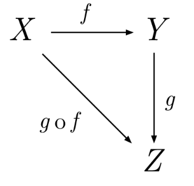

# Javascript函数式编程3：compose（组合）

如果一个值要经过多个函数，才能变成另外一个值，就可以把所有中间步骤合并成一个函数，这叫做"组合"（compose）。



上图中，`X`和`Y`之间的变形关系是函数`f`，`Y`和`Z`之间的变形关系是函数`g`，那么`X`和`Z`之间的关系，就是`g`和`f`的合成函数`g·f`。

上图的代码表示如下：

```
var compose = function(f,g) {
  return function(x) {
    return f(g(x));
  };
};
```
`f`和`g`都是函数，`x`是在它们之间通过“管道”传输的值。使用举例：

```
var toUpperCase = function(x) { return x.toUpperCase(); };
var exclaim = function(x) { return x + '!'; };
var shout = compose(exclaim, toUpperCase);

shout("send in the clowns");
//=> "SEND IN THE CLOWNS!"
```

在`compose`的定义中，`g`将先于`f`执行，因此就创建了一个**从右到左**的数据流。这样做的可读性远远高于嵌套一大堆的函数调用，如果不用组合，`shout`函数将会是这样的：

```
var shout = function(x){
  return exclaim(toUpperCase(x));
};
```
让代码从右向左运行，而不是由内而外运行。一个与顺序相关的例子：

```
var head = function(x) { return x[0]; };
var reverse = reduce(function(acc, x){ return [x].concat(acc); }, []);
var last = compose(head, reverse);

last(['jumpkick', 'roundhouse', 'uppercut']);
//=> uppercut
reverse反转列表，head 取列表中的第一个元素，结果是取列表的最后一个元素
```
组合的概念来自于数学，所有的组合都需满足***结合律（associativity）***这个特性。


```
// 结合律（associativity）
var associative = compose(f, compose(g, h)) == compose(compose(f, g), h);
// true
```

符合***结合律***意味着并不关心你是把`g`和`h`分到一组，还是把`f`和`g`分到一组。

```
// 上面的例子中我们必须要写两个组合才行，但既然组合是符合结合律的，我们就可以只写一个
// 而且想传给它多少个函数就传给它多少个，然后让它自己决定如何分组。

var lastUpper = compose(toUpperCase, head, reverse);
lastUpper(['jumpkick', 'roundhouse', 'uppercut']);
//=> 'UPPERCUT'

var loudLastUpper = compose(exclaim, toUpperCase, head, reverse);
loudLastUpper(['jumpkick', 'roundhouse', 'uppercut']);
//=> 'UPPERCUT!'

```
结合律的一大好处是任何一个函数分组都可以被拆开来，然后再以它们自己的组合方式打包在一起。重构上面的例子：

```
var loudLastUpper = compose(exclaim, toUpperCase, head, reverse);

// 或
var last = compose(head, reverse);
var loudLastUpper = compose(exclaim, toUpperCase, last);

// 或
var last = compose(head, reverse);
var angry = compose(exclaim, toUpperCase);
var loudLastUpper = compose(angry, last);

// 更多变种...
```

## TODO

- 类型签名（Hindley-Milner）
- 函子（Functor）
- Monad Functor
- Applicative Functor
