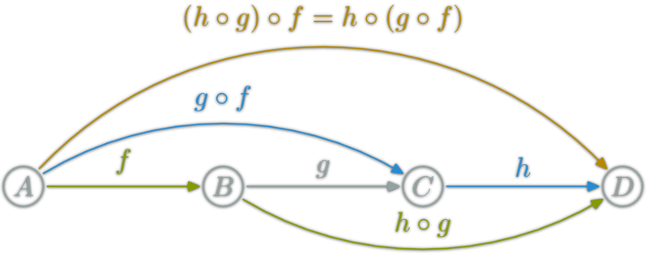

# Javascript函数式编程3：compose（组合）

## 组合
如果一个值要经过多个函数，才能变成另外一个值，就可以把所有中间步骤合并成一个函数，这叫做"组合"（compose）。


上图中，`X`和`Y`之间的变形关系是函数`f`，`Y`和`Z`之间的变形关系是函数`g`，那么`X`和`Z`之间的关系，就是`g`和`f`的合成函数`g·f`。

上图的代码表示如下：

```
let compose = function(f,g) {
  return function(x) {
    return f(g(x));
  };
};
```
`f`和`g`都是函数，`x`是在它们之间通过“管道”传输的值。使用举例：

```
let toUpperCase = function(x) { return x.toUpperCase(); };
let exclaim = function(x) { return x + '!'; };
let shout = compose(exclaim, toUpperCase);

shout("send in the clowns");
//=> "SEND IN THE CLOWNS!"
```

在`compose`的定义中，`g`将先于`f`执行，因此就创建了一个**从右到左**的数据流。这样做的可读性远远高于嵌套一大堆的函数调用，如果不用组合，`shout`函数将会是这样的：

```
let shout = function(x){
  return exclaim(toUpperCase(x));
};
```
让代码从右向左运行，而不是由内而外运行。一个与顺序相关的例子：

```
let head = function(x) { return x[0]; };
let reverse = reduce(function(acc, x){ return [x].concat(acc); }, []);
let last = compose(head, reverse);

last(['jumpkick', 'roundhouse', 'uppercut']);
//=> uppercut
reverse反转列表，head 取列表中的第一个元素，结果是取列表的最后一个元素
```
组合的概念来自于数学，所有的组合都需满足**结合律（associativity）**这个特性。



```
// 结合律（associativity）
let associative = compose(f, compose(g, h)) == compose(compose(f, g), h);
// true
```

符合**结合律**意味着并不关心你是把`g`和`h`分到一组，还是把`f`和`g`分到一组。

```
// 上面的例子中我们必须要写两个组合才行，但既然组合是符合结合律的，我们就可以只写一个
// 而且想传给它多少个函数就传给它多少个，然后让它自己决定如何分组。

let lastUpper = compose(toUpperCase, head, reverse);
lastUpper(['jumpkick', 'roundhouse', 'uppercut']);
//=> 'UPPERCUT'

let loudLastUpper = compose(exclaim, toUpperCase, head, reverse);
loudLastUpper(['jumpkick', 'roundhouse', 'uppercut']);
//=> 'UPPERCUT!'

```
结合律的一大好处是任何一个函数分组都可以被拆开来，然后再以它们自己的组合方式打包在一起。重构上面的例子：

```
let loudLastUpper = compose(exclaim, toUpperCase, head, reverse);

// 或
let last = compose(head, reverse);
let loudLastUpper = compose(exclaim, toUpperCase, last);

// 或
let last = compose(head, reverse);
let angry = compose(exclaim, toUpperCase);
let loudLastUpper = compose(angry, last);

// 更多变种...
```

关于如何组合，并没有标准的答案——我们只是以自己喜欢的方式搭乐高积木罢了。通常来说，最佳实践是让组合可重用，就像上面的`last`和`angry`那样。

## Pointfree（"无值"风格）

定义：不使用所要处理的值，只合成运算过程。

把数据处理的过程，定义成一种与参数无关的合成运算。不需要用到代表数据的那个参数，只要把一些简单的运算步骤合成在一起即可。

请看下面的例子。

```
let addOne = x => x + 1;
let square = x => x * x;

```
上面是两个简单函数addOne和square。

把它们合成一个运算。

```
let addOneThenSquare = R.pipe(addOne, square);
addOneThenSquare(2) //  9
```
上面代码中，addOneThenSquare是一个合成函数。定义它的时候，根本不需要提到要处理的值，这就是 Pointfree。

Pointfree 的本质就是使用一些通用的函数，组合出各种复杂运算。上层运算不要直接操作数据，而是通过底层函数去处理。这就要求，将一些常用的操作封装成函数。

比如，读取对象的role属性，不要直接写成obj.role，而是要把这个操作封装成函数。

```
let prop = (p, obj) => obj[p];
let propRole = R.curry(prop)('role');
```
上面代码中，prop函数封装了读取操作。它需要两个参数p（属性名）和obj（对象）。这时，要把数据obj要放在最后一个参数，这是为了方便柯里化。函数propRole则是指定读取role属性，下面是它的用法（查看完整代码）。

```
let isWorker = s => s === 'worker';
let getWorkers = R.filter(R.pipe(propRole, isWorker));

let data = [
  {name: '张三', role: 'worker'},
  {name: '李四', role: 'worker'},
  {name: '王五', role: 'manager'},
];
getWorkers(data)
// [
//   {"name": "张三", "role": "worker"},
//   {"name": "李四", "role": "worker"}
// ]
```
上面代码中，data是传入的值，getWorkers是处理这个值的函数。定义getWorkers的时候，完全没有提到data，这就是 Pointfree。

简单说，Pointfree 就是运算过程抽象化，处理一个值，但是不提到这个值。这样做有很多好处，它能够让代码更清晰和简练，更符合语义，更容易复用，测试也变得轻而易举。

## 范畴学
范畴学（category theory）是数学中的一个抽象分支，能够形式化诸如集合论（set theory）、类型论（type theory）、群论（group theory）以及逻辑学（logic）等数学分支中的一些概念。范畴学主要处理对象（object）、态射（morphism）和变化式（transformation），而这些概念跟编程的联系非常紧密。

什么是范畴呢？

 [维基百科](https://en.wikipedia.org/wiki/Category_(mathematics))的定义如下：

 > "范畴就是使用箭头连接的物体。"（In mathematics, a category is an algebraic structure that comprises "objects" that are linked by "arrows". ）

也就是说，彼此之间存在某种关系的概念、事物、对象等等，都构成"范畴"。随便什么东西，只要能找出它们之间的关系，就能定义一个"范畴"。


上图中，**各个点与它们之间的箭头**，就构成一个范畴。

箭头表示范畴成员之间的关系，正式的名称叫做"态射"（morphism）。
既然"范畴"是满足某种变形关系的所有对象，就可以总结出它的模型。

所以，有着以下这些组件（component）的搜集（collection）就构成了一个范畴：
> - 对象的搜集
> - 态射的搜集
> - 态射的组合
> - identity 这个独特的态射

范畴学抽象到足以模拟任何事物，不过目前我们最关心的还是类型和函数，所以让我们把范畴学运用到它们身上看看。

- 对象的搜集

>> 对象就是数据类型，例如 String、Boolean、Number 和 Object 等等。通常我们把数据类型视作所有可能的值的一个集合（set）。像 Boolean 就可以看作是 [true, false] 的集合，Number 可以是所有实数的一个集合。把类型当作集合对待是有好处的，因为我们可以利用集合论（set theory）处理类型。

- 态射的搜集

>> 态射是标准的、普通的纯函数。

- 态射的组合

>> 你可能猜到了，这就是本节所介绍的组合。前面已经讨论过 compose 函数是符合结合律的，这并非巧合，结合律是在范畴学中对任何组合都适用的一个特性。

这张图展示了什么是组合：


这里有一个具体的例子：

```
let g = function(x){ return x.length; };
let f = function(x){ return x === 4; };
let isFourLetterWord = compose(f, g);
```

- identity 这个独特的态射
一个名为 id 的实用函数。这个函数接受随便什么输入然后原封不动地返回它：

```let id = function(x){ return x; };```

一个可以替代给定值的函数（一个假装自己是普通数据的函数，先不要问我有什么用）。

id 函数跟组合一起使用简直完美。下面这个特性对所有的一元函数（unary function）（一元函数：只接受一个参数的函数） f 都成立：

```
// identity
compose(id, f) == compose(f, id) == f;
// true
```
这就是实数的[单位元（identity property）](https://zh.wikipedia.org/wiki/單位元)嘛！如果这还不够清楚直白，别着急。很快我们就会到处使用 id 了，不过暂时我们还是把它当作一个替代给定值的函数。这对写 pointfree 的代码非常有用。

以上就是类型和函数的范畴。

## 总结
组合像一系列管道那样把不同的函数联系在一起，数据就可以也必须在其中流动——毕竟纯函数就是输入对输出，所以打破这个链条就是不尊重输出，就会让我们的应用一无是处。

组合是高于其他所有原则的设计原则，这是因为组合让我们的代码简单而富有可读性。

另外范畴学将在应用架构、模拟副作用和保证正确性方面扮演重要角色。


## 下一节：[示例应用（flickr）](./flickr.md)